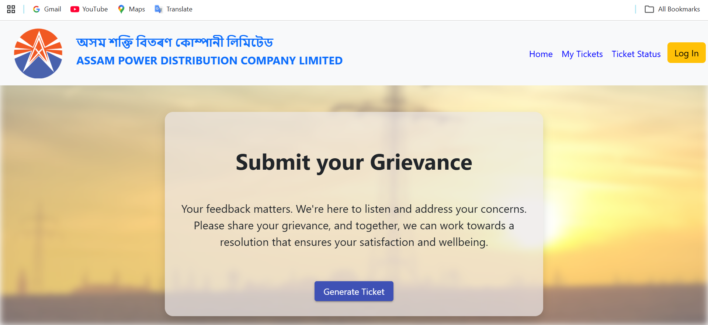

# ⚡ APDCL Grievance Portal — Frontend

The frontend of an enterprise grievance management portal built for
**APDCL (Assam Power Distribution Company Ltd)** using Angular 16,
TypeScript, and SCSS — developed during an Application Development Internship.

---

## 📌 Overview

This is the Angular-based frontend of a full-stack grievance management system
built for APDCL. It allows citizens to submit, track, and resolve power-related
complaints through a modern, responsive web interface. The portal was designed
to modernize APDCL's existing complaint workflow and handle 500+ concurrent users,
reducing average complaint resolution time by 30%.

---

## 🚀 Features

- 📝 Grievance submission form for citizens
- 📋 Complaint tracking and status updates
- 👤 User authentication and role-based access
- 🗺️ Route-based navigation with Angular Router
- 📱 Responsive UI built with Angular components and SCSS
- 🔗 REST API integration with Django backend
- 🏗️ Production-ready build via Angular CLI (`dist/apdcl`)

---

## 🛠️ Tech Stack

| Category      | Technology                        |
|---------------|-----------------------------------|
| Framework     | Angular 16 (Angular CLI v16.1.3)  |
| Language      | TypeScript, JavaScript            |
| Styling       | CSS, SCSS                         |
| Structure     | HTML (41.8%)                      |
| Server        | Node.js (`server.js`)             |
| Backend       | Django + MongoDB (separate repo)  |
| Build Tool    | Angular CLI                       |

---

## 📂 Project Structure
```
APDCL-grievance-frontend/
│
├── src/                    # Main Angular source code
│   ├── app/                # Components, services, modules
│   ├── assets/             # Static assets
│   └── environments/       # Environment configs
├── routes/                 # Route definitions
├── dist/apdcl/             # Production build output
├── angular.json            # Angular CLI configuration
├── server.js               # Node server for serving the app
├── package.json            # Dependencies
├── tsconfig.json           # TypeScript configuration
└── README.md
```

---

## ⚙️ Setup & Installation

1. **Clone the repository**
```bash
   git clone https://github.com/Jiasha-nath/APDCL-grievance-frontend.git
   cd APDCL-grievance-frontend
```

2. **Install dependencies**
```bash
   npm install
```

3. **Run the development server**
```bash
   ng serve
```
   Navigate to `http://localhost:4200/` — the app reloads automatically on file changes.

4. **Build for production**
```bash
   ng build
```
   Build artifacts are stored in the `dist/apdcl/` directory.

---

## 🧪 Running Tests
```bash
# Unit tests (Karma)
ng test

# End-to-end tests
ng e2e
```

---

## 💡 How It Works
```
Citizen opens portal
    ↓
Submits grievance via Angular form
    ↓
Angular Router handles navigation
    ↓
HTTP service calls Django REST API
    ↓
MongoDB stores complaint data
    ↓
Status updates returned and displayed
```

---

## 📸 Screenshot



---

## 🔗 Related Repository

This is the **frontend only**. The full-stack project includes:
- **Backend:** Django + MongoDB (REST API)

---

## 👤 Author

**Jiasha Nath**
[](https://www.linkedin.com/in/jiasha-nath-523b79211)
[](mailto:jiasha.nath.adtu@gmail.com)

---

## 📜 License

This project is licensed under the MIT License.
